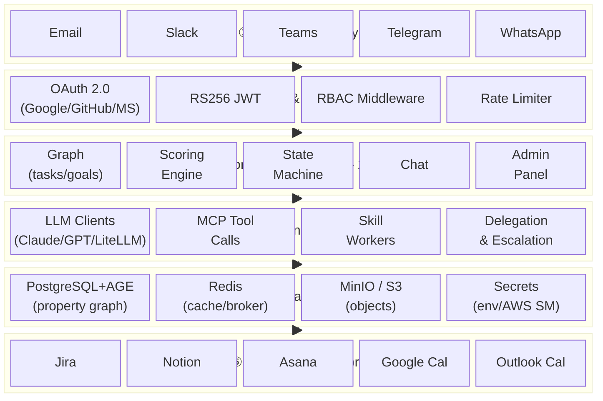
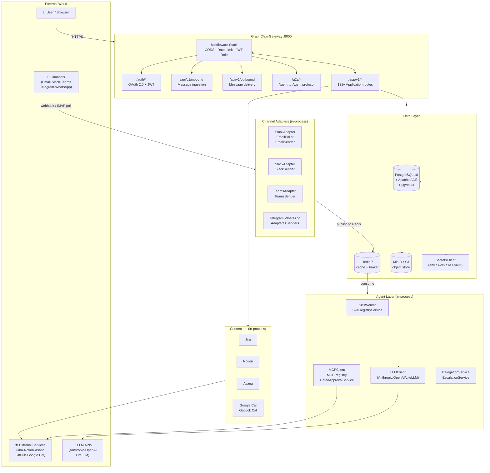
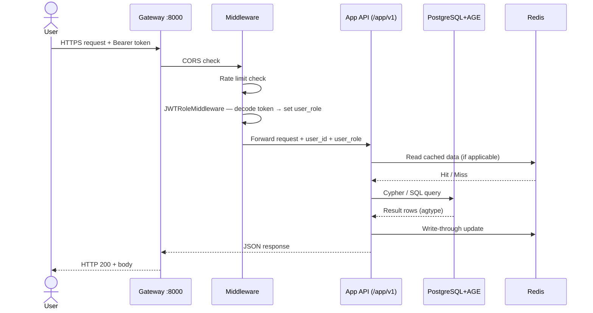

# 01 — Solution Overview

GraphClaw is an **AI-native task orchestration platform**. It turns natural-language
communication from any channel (email, Slack, Teams …) into a live property graph of
tasks, goals, resources, and constraints — then uses AI agents to prioritise, delegate,
and track work autonomously.

---

## Six Capability Layers

---

## High-Level Architecture Block Diagram

---

## Request Lifecycle (Happy Path)

---

## Extensibility Philosophy

GraphClaw is designed so every integration point is an **abstract base class** backed by a pluggable implementation:

| Extension Point | ABC | Current Implementations | Add New By |
|----------------|-----|------------------------|------------|
| Graph database | `GraphStore` | `AgeGraphStore` | Implement ABC → wire in `db/factory.py` |
| Query engine | `GraphQueryEngine` | `AgeGraphQueryEngine` | Same pattern |
| Object storage | `StorageClient` | `S3StorageClient` | Implement ABC → inject in gateway lifespan |
| Secrets | `SecretsClient` | `EnvFile`, `AWSSecrets`, `HashiCorpVault` | Implement ABC |
| LLM | `LLMClient` | `AnthropicLLMClient`, `OpenAILLMClient`, `LiteLLMLLMClient` | New module in `llm/` |
| Channel | `ChannelAdapter` | Email, Slack, Teams, Telegram, WhatsApp | New folder in `gateway/channels/` |
| Connector | `ConnectorBase` | Jira, Notion, Asana, Google Cal, Outlook | New folder in `connectors/` |
| MCP adapter | MCP protocol | GitHub, Google Cal, Slack | New folder in `mcp/adapters/` |
