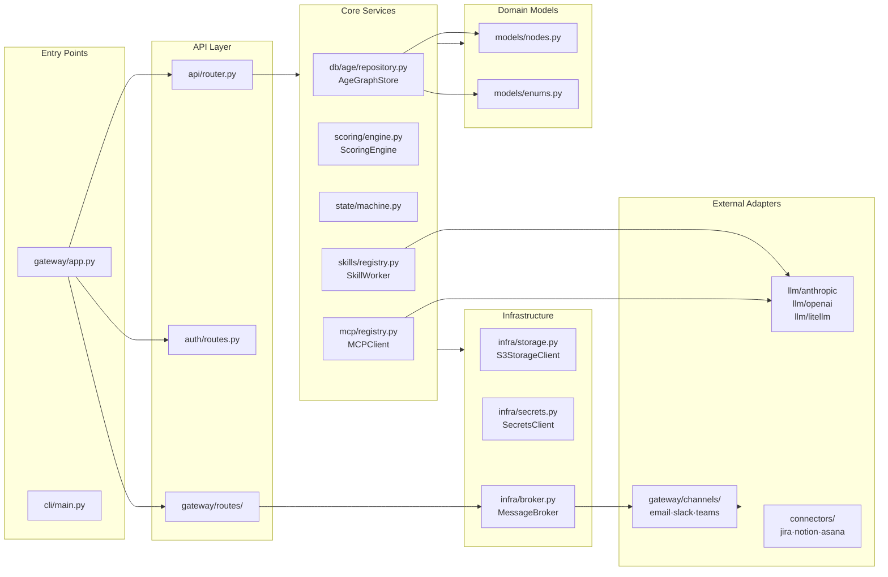

# 02 — Project Structure

## Repository Layout

```
graphclaw/
│
├── src/graphclaw/                  ← All Python source (installed as package)
│   │
│   ├── models/                     ← Domain model (nodes, enums, edges)
│   │   ├── nodes.py                  All graph node types (TaskNode, GoalNode, …)
│   │   └── enums.py                  All domain enumerations
│   │
│   ├── gateway/                    ← HTTP entry point + channel adapters
│   │   ├── app.py                    FastAPI application factory + lifespan
│   │   ├── server.py                 Uvicorn entry point
│   │   ├── routes/
│   │   │   ├── inbound.py            POST /api/v1/inbound/messages
│   │   │   └── outbound.py           POST /api/v1/outbound/messages
│   │   ├── channels/               ← One sub-package per channel
│   │   │   ├── email/                adapter · poller · sender · normalizer · config
│   │   │   ├── slack/                adapter · sender · normalizer · config
│   │   │   ├── teams/                adapter · sender · normalizer · config
│   │   │   ├── telegram/             adapter · sender
│   │   │   └── whatsapp/             adapter · sender
│   │   ├── channel_registry.py       Discovers & registers all ChannelAdapter instances
│   │   ├── alias_resolver.py         Maps channel aliases → canonical user_id
│   │   └── attachment_handler.py     Saves inbound attachments to S3
│   │
│   ├── api/                        ← All /app/v1/* route modules (131+ routes)
│   │   ├── router.py                 Aggregates all sub-routers under /app/v1
│   │   ├── graph.py                  Tasks / goals / resources / edges
│   │   ├── scoring.py                Scoring results + simulation
│   │   ├── state.py                  State machine transitions + history
│   │   ├── events.py                 SSE event stream
│   │   ├── chat.py                   Chat messages
│   │   ├── config.py                 Runtime configuration
│   │   ├── secrets.py                BYOK secrets vault
│   │   ├── approvals.py              Human approval queue
│   │   ├── settings.py               User settings, orgs, LLM keys
│   │   ├── skill_registry.py         Skill catalogue + worker status
│   │   ├── mcp_registry.py           MCP server registry + approvals
│   │   ├── agents.py                 Agent canvas CRUD
│   │   ├── agent.py                  Agent monitor (status, briefing, queue)
│   │   ├── compliance.py             Audit trail, GDPR export
│   │   ├── a2a_keys.py               Agent-to-agent API keys
│   │   └── admin/                  ← Admin panel (9 sub-modules)
│   │       ├── router.py             Aggregates admin sub-routers
│   │       ├── members.py            Team member management + invites
│   │       ├── features.py           Feature flags, channels, marketplace
│   │       ├── llm.py                LLM provider keys + budget
│   │       ├── llm_judge.py          LLM-as-judge config + results
│   │       ├── guardrails.py         Content guardrail rules
│   │       ├── sso.py                SSO / SAML configuration
│   │       ├── audit.py              Audit log viewer
│   │       ├── infra.py              Deployment status, cluster health, backups
│   │       └── connectors.py         External connector management
│   │
│   ├── auth/                       ← Authentication & authorisation
│   │   ├── jwt.py                    JWTService (RS256 issue / verify / revoke)
│   │   ├── oauth.py                  OAuthService (Google / GitHub / Microsoft)
│   │   ├── middleware.py             get_current_user_id dependency
│   │   ├── routes.py                 /auth/* endpoints + dev-token
│   │   └── provisioning.py           UserProvisioningService (new user setup)
│   │
│   ├── db/                         ← Database abstraction
│   │   ├── base.py                   GraphStore ABC + GraphQueryEngine ABC
│   │   ├── factory.py                create_graph_store() / create_query_engine()
│   │   └── age/                    ← Apache AGE implementation
│   │       ├── connection.py         Pool factory (pgbouncer-aware)
│   │       ├── repository.py         AgeGraphStore (all CRUD + Cypher)
│   │       ├── utils.py              agtype parser, escaping helpers
│   │       └── queries/
│   │           ├── engine.py         AgeGraphQueryEngine
│   │           └── critical_path.py  Critical path Cypher query
│   │
│   ├── scoring/                    ← Priority scoring engine
│   │   ├── engine.py                 ScoringEngine (orchestrates 7 factors)
│   │   └── factors/                ← One file per scoring factor (W1–W7)
│   │       ├── timeline_urgency.py   W1
│   │       ├── dependency_weight.py  W2
│   │       ├── critical_path.py      W3
│   │       ├── blocker.py            W4
│   │       ├── override.py           W5
│   │       ├── resource_risk.py      W6
│   │       └── constraint.py         W7
│   │
│   ├── state/                      ← Task state machine
│   │   ├── machine.py                Valid transitions map + guard logic
│   │   └── transitions.py            Transition execution + history append
│   │
│   ├── agent/                      ← Agent orchestration
│   │   ├── delegation.py             DelegationService (task → resource matching)
│   │   └── escalation.py             EscalationService (SLA breach detection)
│   │
│   ├── skills/                     ← Skill execution runtime
│   │   ├── registry.py               SkillRegistryService (discover, index, search)
│   │   ├── worker.py                 SkillWorker (execute skill against LLM)
│   │   ├── models.py                 Skill, SkillVersion, WorkerStatus models
│   │   └── definitions/            ← Built-in skill YAML definitions
│   │       ├── meeting-notes-agent/
│   │       ├── pipeline-report-agent/
│   │       ├── linkedin-outreach-agent/
│   │       └── teams-meeting-notes-agent/
│   │
│   ├── mcp/                        ← Model Context Protocol
│   │   ├── registry.py               MCPRegistry (register, list, trust)
│   │   ├── client.py                 MCPClient (call tool on registered server)
│   │   ├── official_registry.py      OfficialMCPRegistry (curated server catalogue)
│   │   ├── approval.py               GatedApprovalService (human-in-the-loop)
│   │   └── adapters/               ← Pre-built MCP server adapters
│   │       ├── github/
│   │       ├── google_calendar/
│   │       └── slack/
│   │
│   ├── llm/                        ← LLM provider clients
│   │   ├── base.py                   LLMClient ABC
│   │   ├── anthropic/client.py       AnthropicLLMClient
│   │   ├── openai/client.py          OpenAILLMClient
│   │   └── litellm/client.py         LiteLLMLLMClient (100+ model providers)
│   │
│   ├── infra/                      ← Cross-cutting infrastructure
│   │   ├── storage.py                StorageClient ABC + S3StorageClient
│   │   ├── secrets.py                SecretsClient ABC + Env/AWS/Vault impls
│   │   ├── broker.py                 MessageBroker (Redis pub/sub)
│   │   └── byok.py                   BYOKService (bring-your-own-key wrapper)
│   │
│   ├── connectors/                 ← External data source integrations
│   │   ├── base.py                   ConnectorBase ABC
│   │   ├── registry.py               ConnectorRegistry
│   │   ├── factory.py                Connector factory
│   │   ├── import_/                ← Task import connectors
│   │   │   ├── jira/
│   │   │   ├── notion/
│   │   │   └── asana/
│   │   └── calendar/               ← Calendar sync connectors
│   │       ├── google/
│   │       └── outlook/
│   │
│   ├── compliance/                 ← GDPR + audit
│   │   ├── audit.py                  AuditLogger (structured event logging)
│   │   ├── gdpr.py                   GDPRService (data export + deletion)
│   │   └── export.py                 DataExportService
│   │
│   ├── migrations/                 ← Database migrations
│   │   ├── runner.py                 Migration runner
│   │   └── catalogue.py             All migration definitions
│   │
│   ├── triggers/                   ← Scheduled + event triggers
│   │   └── schedule.py              Cron-style trigger definitions
│   │
│   ├── inbound/                    ← Inbound message normalisation
│   │   └── processor.py             Routes inbound messages → task updates
│   │
│   ├── a2a/                        ← Agent-to-Agent protocol
│   │   └── routes.py                A2A task push + status update endpoints
│   │
│   └── cli/                        ← CLI entry points (graphclaw command)
│       └── main.py
│
├── docker/                         ← Container definitions
│   ├── docker-compose.yml            Full local dev stack (7 services)
│   ├── Dockerfile                    App / Gateway image
│   ├── Dockerfile.api                API-only variant
│   └── Dockerfile.db                 PostgreSQL + AGE + pgvector image
│
├── infra/                          ← Cloud infrastructure (AWS)
│   ├── iam/                          IAM roles + policies
│   ├── deployment/                   ECS task definition models
│   ├── backup/                       Backup scripts
│   ├── redis/                        Redis cluster config
│   ├── scaling/                      Auto-scaling policies
│   ├── security/                     Security group definitions
│   ├── observability/                CloudWatch dashboards
│   └── ses/                          SES email configuration
│
├── scripts/
│   └── test_api.py                   End-to-end API test suite (92 tests)
│
├── tests/                          ← Pytest test suite (1451 tests)
│   ├── unit/
│   └── integration/
│
└── docs/
    └── architecture/               ← This folder
```

---

## Module Dependency Map



---

## How to Add a New Integration

### New Channel (e.g. Discord)
```
gateway/channels/discord/
  __init__.py
  config.py          DiscordConfig (reads DISCORD_BOT_TOKEN from env)
  normalizer.py      raw Discord payload → InboundMessage
  adapter.py         DiscordChannelAdapter(ChannelAdapter)  ← register in ChannelRegistry
  sender.py          DiscordSender — sends reply via Discord API
```

### New LLM Provider (e.g. Gemini)
```
llm/gemini/
  __init__.py
  client.py          GeminiLLMClient(LLMClient)  ← implement ABC methods
```

### New Connector (e.g. Linear)
```
connectors/import_/linear/
  __init__.py
  client.py          Linear API client
  mapper.py          Linear Issue → TaskNode
  connector.py       LinearConnector(ConnectorBase)  ← register in ConnectorRegistry
```

### New Database Backend (e.g. Neo4j)
```
db/neo4j/
  connection.py      Pool factory for Neo4j
  repository.py      Neo4jGraphStore(GraphStore)  ← implement ABC
  queries/engine.py  Neo4jGraphQueryEngine(GraphQueryEngine)
```
Then update `db/factory.py` to recognise `backend="neo4j"`.
