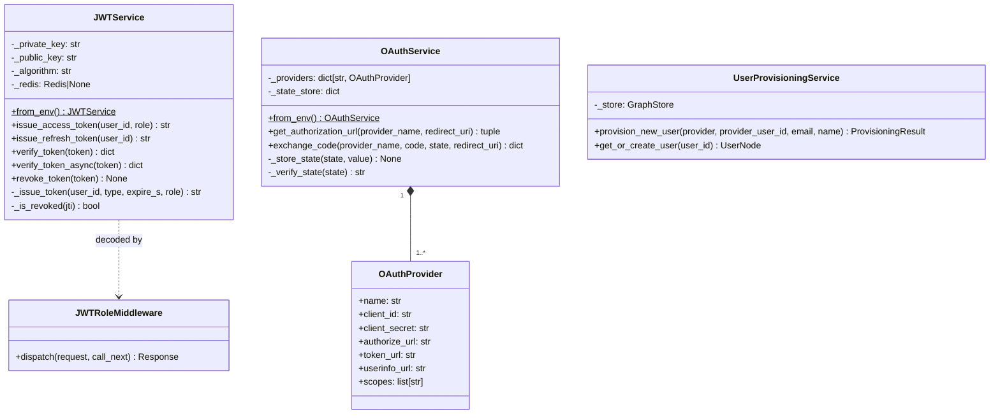
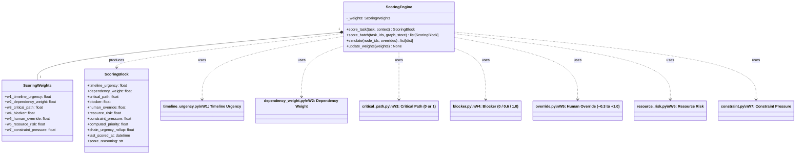
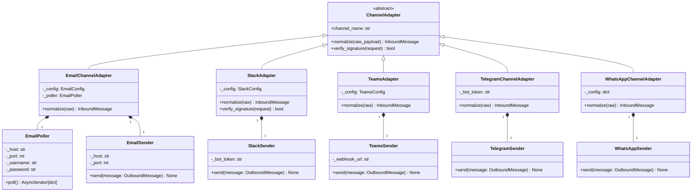
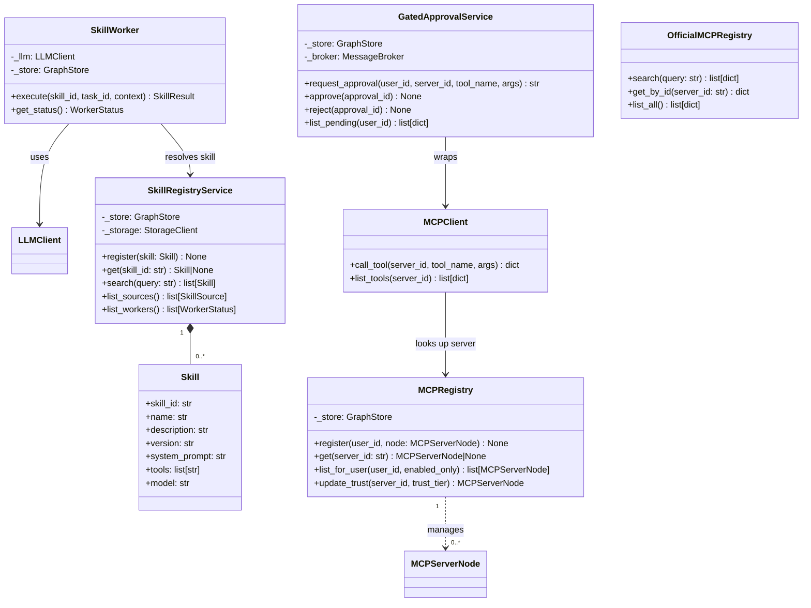

# 03 — Class Diagrams

---

## 1. Core Abstractions (ABC hierarchy)

```mermaid
classDiagram
    class GraphStore {
        <<abstract>>
        +create_node(node: BaseNode) dict
        +get_node(node_id: str) dict|None
        +update_node(node_id: str, props: dict) dict
        +delete_node(node_id: str) bool
        +list_nodes(label: str) list[dict]
        +create_edge(src, tgt, edge_type, props) dict
        +get_edges(node_id, direction, edge_type) list[dict]
        +vector_search(embedding, label, k) list[dict]
    }
    class AgeGraphStore {
        -_pool: AsyncConnectionPool
        -_graph: str
        +execute_cypher(query) list
    }
    GraphStore <|-- AgeGraphStore

    class GraphQueryEngine {
        <<abstract>>
        +critical_path(goal_id: str) list[dict]
        +dependencies(task_id: str, depth: int) list[dict]
        +blocked_tasks(user_id: str) list[dict]
    }
    class AgeGraphQueryEngine {
        -_store: AgeGraphStore
    }
    GraphQueryEngine <|-- AgeGraphQueryEngine

    class StorageClient {
        <<abstract>>
        +read(path: str) bytes
        +write(path, data, content_type) None
        +delete(path: str) None
        +list_objects(prefix: str) list[str]
        +exists(path: str) bool
    }
    class S3StorageClient {
        -_bucket: str
        -_endpoint_url: str|None
        -_region: str
        -_client: object
        -_get_client() object
    }
    StorageClient <|-- S3StorageClient

    class SecretsClient {
        <<abstract>>
        +get_secret(key: str) str
        +set_secret(key, value) None
        +delete_secret(key: str) None
        +list_secrets() list[str]
    }
    class EnvFileSecretsClient {
        -_path: str
    }
    class AWSSecretsClient {
        -_prefix: str
        -_region: str
    }
    class HashiCorpVaultClient {
        -_url: str
        -_mount: str
        -_token: str
    }
    SecretsClient <|-- EnvFileSecretsClient
    SecretsClient <|-- AWSSecretsClient
    SecretsClient <|-- HashiCorpVaultClient

    class LLMClient {
        <<abstract>>
        +complete(messages, model, tools) LLMResponse
        +stream(messages, model) AsyncIterator
        +embed(texts) list[list[float]]
    }
    class AnthropicLLMClient {
        -_client: Anthropic
        -_default_model: str
    }
    class OpenAILLMClient {
        -_client: OpenAI
        -_default_model: str
    }
    class LiteLLMLLMClient {
        -_default_model: str
    }
    LLMClient <|-- AnthropicLLMClient
    LLMClient <|-- OpenAILLMClient
    LLMClient <|-- LiteLLMLLMClient
```

---

## 2. Domain Node Hierarchy

```mermaid
classDiagram
    class BaseNode {
        +id: str
        +label: str
        +created_at: datetime
        +updated_at: datetime
        +version: int
    }

    class TaskNode {
        +task_type: TaskType
        +title: str
        +description: str
        +state: TaskState
        +state_history: list[StateHistoryEntry]
        +timeline: Timeline
        +scoring: ScoringBlock
        +progress: ProgressBlock
        +override: OverrideBlock
        +autonomy: AutonomyBlock
        +on_critical_path: bool
        +tags: list[str]
    }

    class GoalNode {
        +title: str
        +description: str
        +owner_id: str
        +state: GoalState
        +priority: GoalPriority
        +origin: GoalOrigin
        +timeline: GoalTimeline
        +progress: GoalProgress
        +success_criteria: list[str]
    }

    class UserNode {
        +email: str
        +name: str
        +role: str
        +preferences: UserPreferences
        +behavioral_model: BehavioralModel
        +working_hours: WorkingHours
    }

    class ResourceNode {
        +name: str
        +resource_type: ResourceType
        +capacity: CapacityModel
        +reliability: ReliabilityModel
        +availability_status: AvailabilityStatus
        +current_risk: CurrentRisk
    }

    class ConstraintNode {
        +title: str
        +constraint_type: ConstraintType
        +scope: ConstraintScope
        +threshold: float
        +current_value: float
        +risk_level: RiskLevel
    }

    class OrganizationNode {
        +name: str
        +domain: str|None
        +owner_id: str
        +members: list[OrgMember]
        +settings: OrgSettings
    }

    class WorkspaceNode {
        +name: str
        +org_id: str
        +visibility: WorkspaceVisibility
        +owner_id: str
    }

    class MCPServerNode {
        +name: str
        +description: str
        +command: str
        +transport: MCPTransport
        +trust_tier: TrustTier
        +enabled: bool
        +user_id: str
    }

    class CheckinNode {
        +task_id: str
        +resource_id: str
        +state: CheckinState
        +message: str
        +response: str|None
        +scheduled_at: datetime
    }

    class VisibilityGrantNode {
        +grantor_id: str
        +grantee_id: str
        +scope: VisibilityScope
        +expires_at: datetime|None
    }

    BaseNode <|-- TaskNode
    BaseNode <|-- GoalNode
    BaseNode <|-- UserNode
    BaseNode <|-- ResourceNode
    BaseNode <|-- ConstraintNode
    BaseNode <|-- OrganizationNode
    BaseNode <|-- WorkspaceNode
    BaseNode <|-- MCPServerNode
    BaseNode <|-- CheckinNode
    BaseNode <|-- VisibilityGrantNode
```

---

## 3. Auth & Security Classes

---

## 4. Scoring Engine & Factors

---

## 5. Channel Adapter Hierarchy

---

## 6. Skill & MCP Execution Classes

