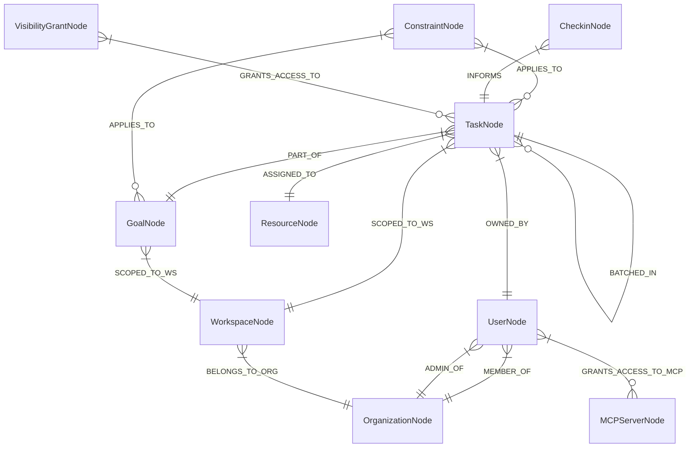
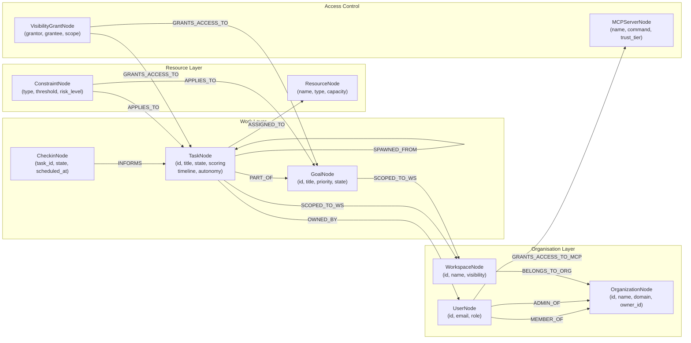
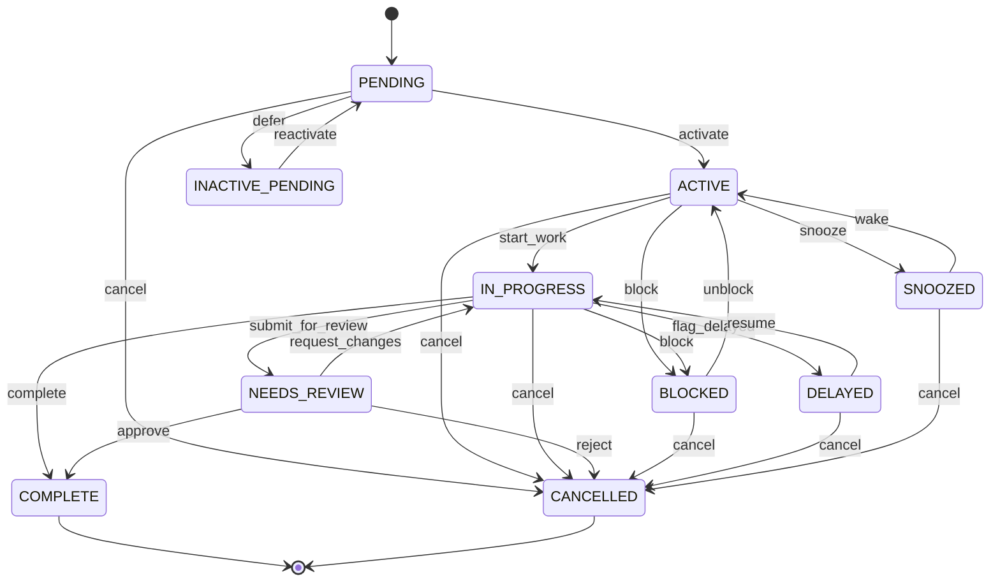
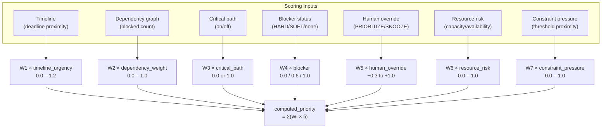

# 04 — Graph Database Schema

GraphClaw stores its entire domain in a **property graph** backed by PostgreSQL 18 +
Apache AGE.  Every entity is a labelled vertex; relationships are directed, labelled edges.
All properties are stored as `agtype` (AGE's JSON superset).

---

## Node Types (Vertex Labels)

| Label | Description | Key Properties |
|-------|-------------|----------------|
| `TaskAtomic` | Single indivisible unit of work | id, title, state, scoring, timeline, autonomy |
| `TaskComposite` | Parent task with sub-tasks | id, title, state, breakdown_strategy, gate_type |
| `TaskDelegated` | Task owned by an external resource | id, title, state, assigned_to |
| `TaskMilestone` | Key deliverable checkpoint | id, title, state, timeline.deadline |
| `TaskApproval` | Requires explicit human sign-off | id, title, state, requires_approval_from |
| `TaskRecurring` | Repeating task with schedule | id, title, state, recurrence_rule |
| `GoalNode` | High-level objective | id, title, priority (P1/P2/P3), state, success_criteria |
| `UserNode` | Platform user | id, email, name, role, working_hours |
| `ResourceNode` | Human or AI agent resource | id, name, resource_type, capacity, availability_status |
| `ConstraintNode` | Budget / deadline / compliance constraint | id, constraint_type, threshold, current_value, risk_level |
| `CheckinNode` | Asynchronous status check-in message | id, task_id, resource_id, state, scheduled_at |
| `OrganizationNode` | Tenant / company | id, name, domain, owner_id, members |
| `WorkspaceNode` | Project workspace within an org | id, name, org_id, visibility |
| `VisibilityGrantNode` | Fine-grained access grant record | id, grantor_id, grantee_id, scope |
| `MCPServerNode` | Registered MCP tool server | id, name, command, transport, trust_tier, enabled |

---

## Edge Types (Edge Labels)



---

## Full Entity Relationship (Mermaid Graph)



---

## Task State Machine



---

## Scoring Model (W1–W7)



---

## Key Cypher Query Patterns

```sql
-- All tasks assigned to a resource
MATCH (t:TaskNode)-[:ASSIGNED_TO]->(r:ResourceNode {id: $resource_id})
RETURN t;

-- Critical path for a goal
MATCH path = (g:GoalNode {id: $goal_id})<-[:PART_OF*1..10]-(t:TaskNode)
WHERE t.on_critical_path = true
RETURN nodes(path), relationships(path);

-- Blocking chain (what does this task block transitively)
MATCH path = (t:TaskNode {id: $task_id})-[:BLOCKS*1..5]->(blocked)
RETURN path;

-- User's MCP servers
MATCH (u:UserNode {id: $user_id})-[:GRANTS_ACCESS_TO_MCP]->(m:MCPServerNode)
WHERE m.enabled = true
RETURN m;

-- Tasks in workspace with state filter
MATCH (t:TaskNode)-[:SCOPED_TO_WS]->(w:WorkspaceNode {id: $ws_id})
WHERE t.state IN ['PENDING', 'IN_PROGRESS', 'BLOCKED']
RETURN t ORDER BY t.scoring.computed_priority DESC;
```
