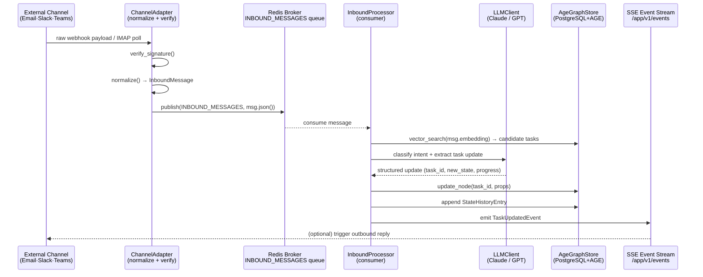
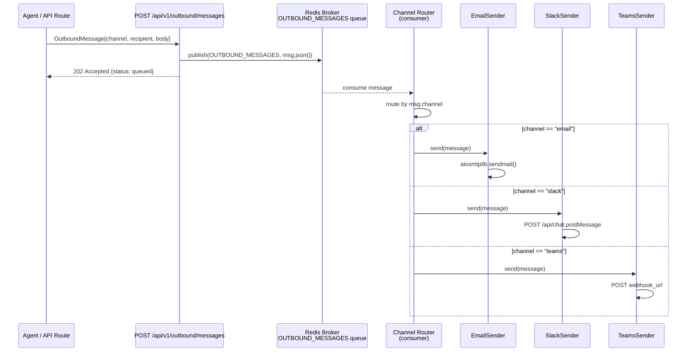
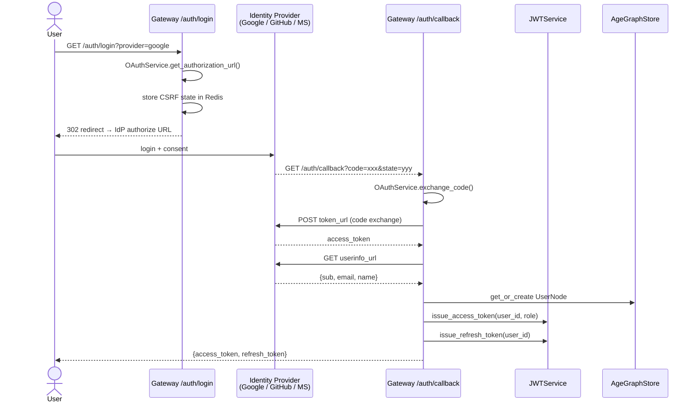
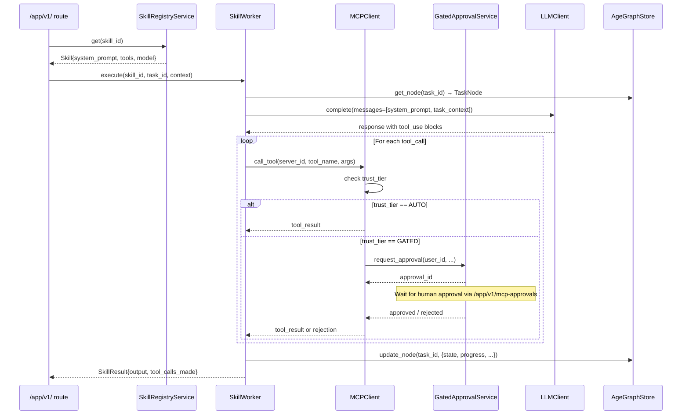
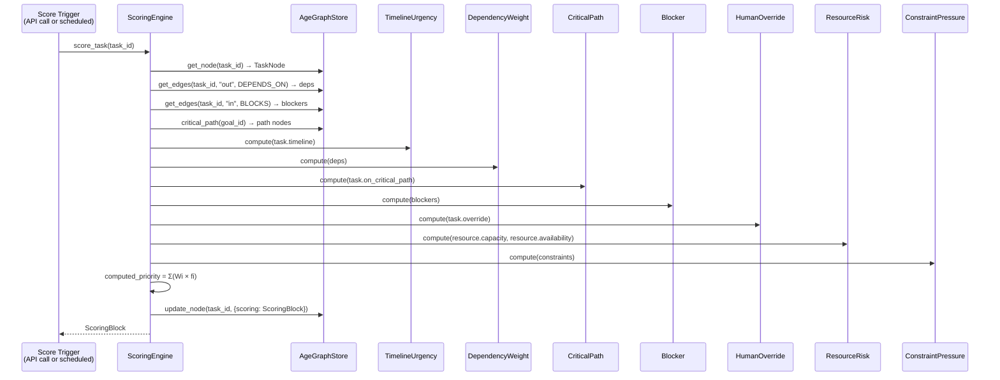
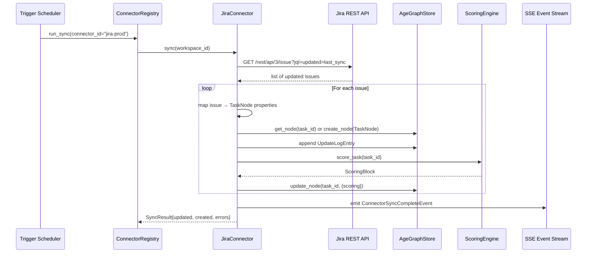
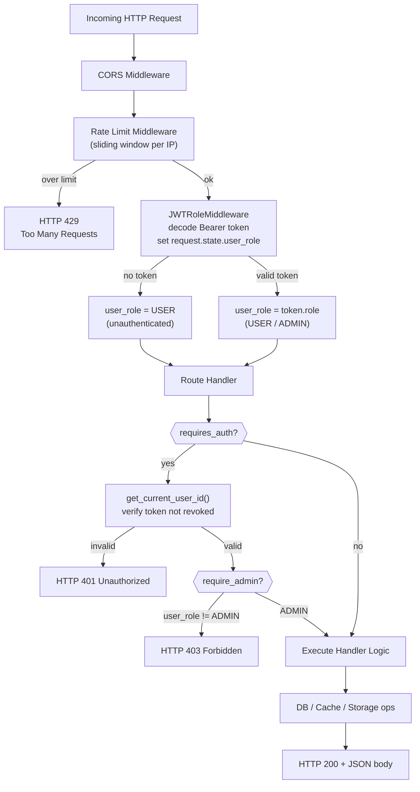
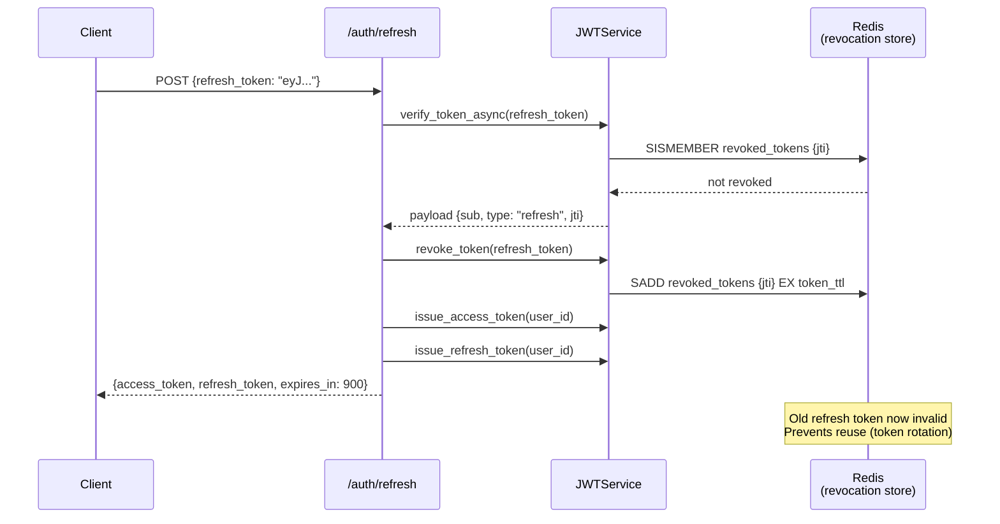

# 05 — Data Flow & UML Sequence Diagrams

---

## 1. Inbound Message Lifecycle
*(Email / Slack / Teams → Task update in graph)*



---

## 2. Outbound Message Delivery
*(Agent reply → Channel delivery)*



---

## 3. OAuth 2.0 Login Flow



---

## 4. Agent Skill Execution Flow



---

## 5. Task Scoring Pipeline



---

## 6. MCP Tool Call — Connector Sync Flow



---

## 7. Sub-Agent Parallel Orchestration Flow

*(Main AgentLoop → SubAgentPool → SubAgentRunners → AGENT_UPDATES → Orchestrator re-engagement)*

```mermaid
sequenceDiagram
    actor User
    participant LOOP as AgentLoop<br/>(Orchestrator)
    participant PLANNER as AgentDispatchPlanner
    participant BROKER as Redis Broker
    participant POOL as SubAgentPool<br/>+ BatchCoordinator
    participant RUNNER as SubAgentRunner(s)<br/>(parallel)
    participant LLM as LLMClient
    participant DB as AgeGraphStore
    participant HEALTH as AgentHealthMonitor
    participant CONSUMER as AgentEventConsumer

    User->>LOOP: chat message / trigger
    LOOP->>LLM: process_chat_message() — tool-use loop
    LLM-->>LOOP: delegate_to_agent(task_A), delegate_to_agent(task_B), delegate_to_agent(task_C)

    LOOP->>PLANNER: plan([task_A, task_B, task_C])
    PLANNER->>DB: query DEPENDS_ON edges for {A,B,C}
    DB-->>PLANNER: A depends_on C; B is independent
    PLANNER-->>LOOP: [[task_B, task_C], [task_A]]

    Note over LOOP: Tier 1: B + C in parallel
    LOOP->>BROKER: publish(AGENT_JOBS, job_B {batch_id=tier1})
    LOOP->>BROKER: publish(AGENT_JOBS, job_C {batch_id=tier1})

    POOL->>BROKER: consume AGENT_JOBS
    POOL->>RUNNER: execute(job_B) [background]
    POOL->>RUNNER: execute(job_C) [background]

    par Runner B
        RUNNER->>BROKER: publish(AGENT_UPDATES, AgentTaskStartedEvent B)
        RUNNER->>LLM: LLM loop with invoke_skill / call_mcp_tool
        RUNNER->>BROKER: publish(AGENT_UPDATES, AgentHeartbeatEvent B) every 60s
        RUNNER->>BROKER: publish(AGENT_UPDATES, AgentTaskCompletedEvent B)
    and Runner C
        RUNNER->>BROKER: publish(AGENT_UPDATES, AgentTaskStartedEvent C)
        RUNNER->>LLM: LLM loop with invoke_skill / call_mcp_tool
        RUNNER->>BROKER: publish(AGENT_UPDATES, AgentTaskCompletedEvent C)
    end

    CONSUMER->>BROKER: consume AGENT_UPDATES
    CONSUMER->>DB: update task_B state, task.intelligence
    CONSUMER->>DB: update task_C state, task.intelligence

    POOL->>POOL: BatchCoordinator: tier1 complete (2/2)
    Note over POOL: Dispatch Tier 2: task_A
    POOL->>BROKER: publish(AGENT_JOBS, job_A {batch_id=tier2})
    RUNNER->>BROKER: publish(AGENT_UPDATES, AgentTaskCompletedEvent A)

    POOL->>POOL: BatchCoordinator: all tiers done
    POOL->>BROKER: publish(TRIGGER_EVENTS, DELEGATION_COMPLETE {session_id, results_summary})

    CONSUMER->>LOOP: AgentLoop.process_chat_message(synthetic: "Delegation complete. Results: ...")
    LOOP->>LLM: Synthesize results → decide next actions
    LLM-->>User: Final orchestrated response

    HEALTH->>HEALTH: check_timeouts() every 30s
    alt heartbeat stale > 300s
        HEALTH->>DB: transition(task_id, BLOCKED)
        HEALTH->>BROKER: publish(AGENT_UPDATES, AgentTaskBlockedEvent)
    end
```

---

## 8. API Request with Role-Based Auth (UML Activity)



---

## 8. Refresh Token Rotation


