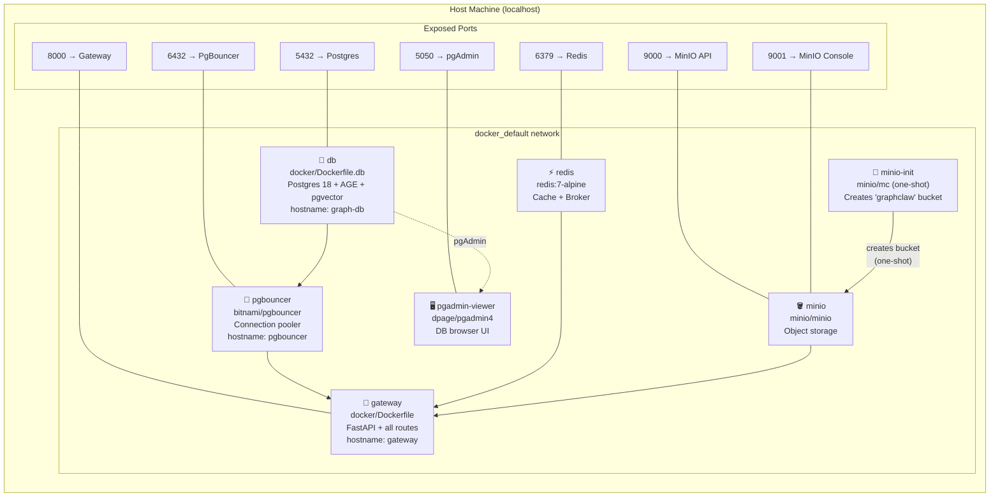
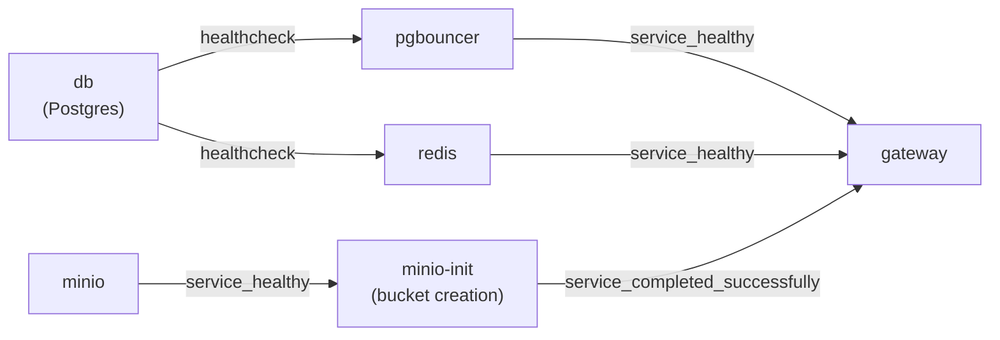
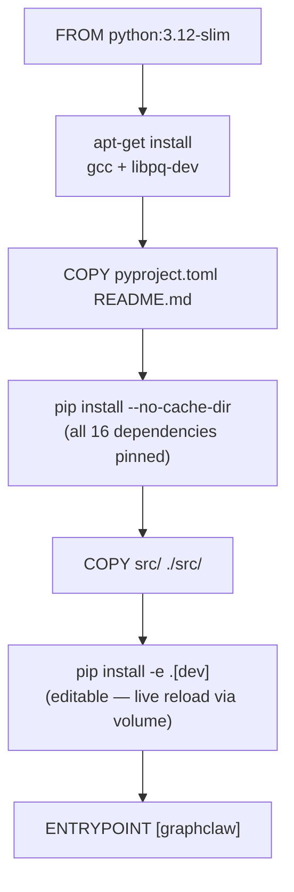

# 06 — Local Deployment (Docker Compose)

---

## Container Stack



---

## Service Dependency Order



---

## Environment Variables

| Variable | Default | Used By | Description |
|----------|---------|---------|-------------|
| `DB_PASSWORD` | `graphclaw_dev` | db, pgbouncer, gateway | Postgres password |
| `MINIO_PASSWORD` | `graphclaw_dev` | minio, gateway | MinIO secret key |
| `ENVIRONMENT` | `development` | gateway | Enables /auth/dev-token |
| `QUERY_TIMEOUT_MS` | `5000` | gateway | AGE query timeout |
| `PYTHONPATH` | `/app` | gateway | Allows `infra/` imports |
| `AWS_ACCESS_KEY_ID` | `graphclaw` | gateway | MinIO access key |
| `AWS_SECRET_ACCESS_KEY` | `graphclaw_dev` | gateway | MinIO secret key |
| `JWT_PRIVATE_KEY` | *(generated)* | gateway | RS256 signing key |
| `JWT_PUBLIC_KEY` | *(generated)* | gateway | RS256 verify key |
| `OAUTH_GOOGLE_CLIENT_ID` | *(unset)* | gateway | Google OAuth |
| `OAUTH_GITHUB_CLIENT_ID` | *(unset)* | gateway | GitHub OAuth |

---

## Volume Mounts (Gateway)

| Host Path | Container Path | Purpose |
|-----------|---------------|---------|
| `../src` | `/app/src` | Live code (uvicorn --reload) |
| `../infra` | `/app/infra` | Cross-package imports |

The gateway runs with `pip install -e ".[dev]"` (editable install) so that
changes to `src/graphclaw/**` are reflected immediately without rebuilding
the image — uvicorn `--reload` watches `/app/src` for changes.

---

## Quick Start

```bash
# 1. Clone and enter repo
cd graphclaw

# 2. Start full stack
docker compose -f docker/docker-compose.yml up -d

# 3. Check health
curl http://localhost:8000/health

# 4. Run end-to-end tests
python scripts/test_api.py          # 92/92 passing

# 5. Open Swagger UI
open http://localhost:8000/docs

# 6. Open pgAdmin (add server: host=db, port=5432, user=graphclaw, pw=graphclaw_dev)
open http://localhost:5050

# 7. Open MinIO console (user=graphclaw, pw=graphclaw_dev)
open http://localhost:9001
```

---

## Image Build Flow



> **Why editable install?**  
> `pip install -e` records a `.pth` pointer to `/app/src` in `site-packages`.
> When Docker mounts `../src:/app/src`, Python finds the live source there.
> Without `-e`, Python imports from a copied snapshot in `site-packages` and
> ignores the volume mount entirely.
