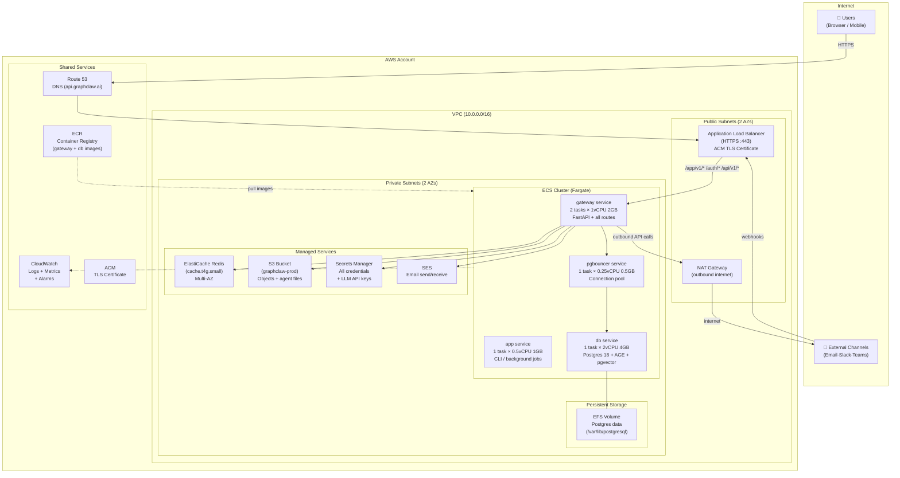
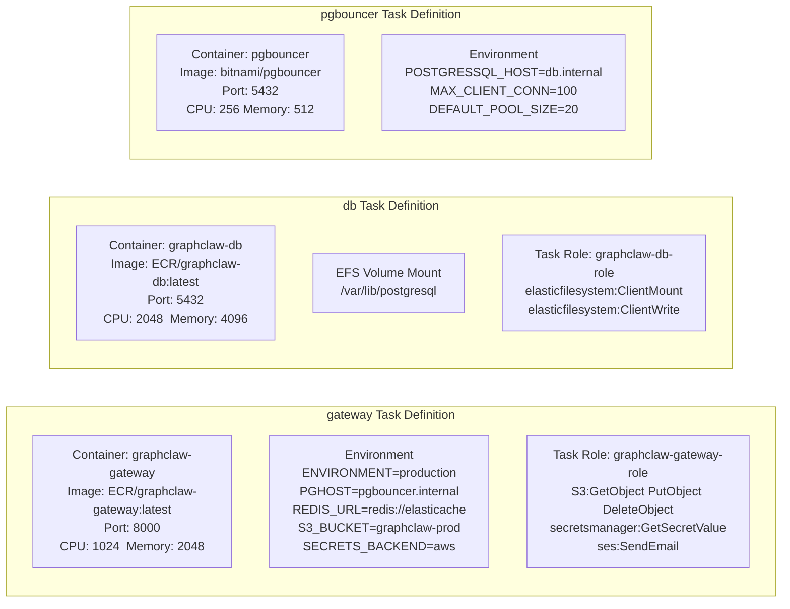
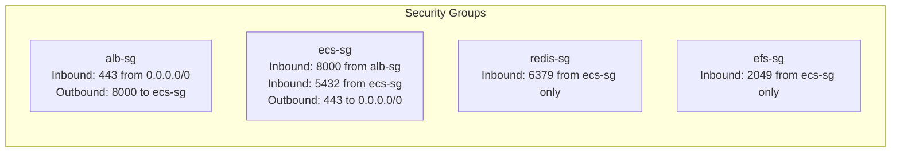
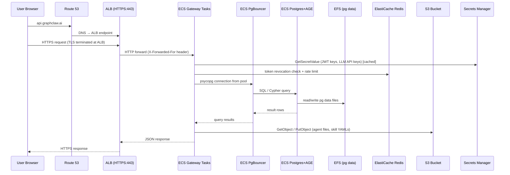
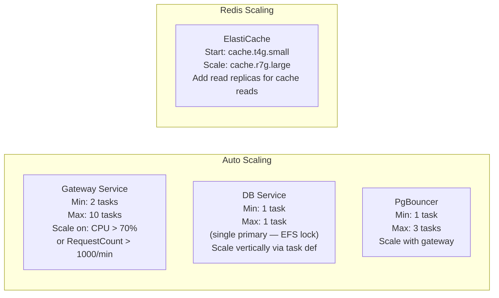
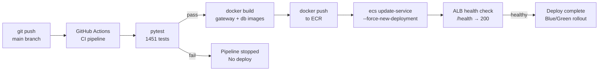

# 07 — AWS Deployment Architecture

GraphClaw runs fully on AWS using managed services where available, and
ECS Fargate for everything that requires a custom runtime (notably the graph
database, which uses Apache AGE — not available on RDS).

---

## AWS Architecture Overview



---

## ECS Task Definitions



---

## IAM Role Map

| Role | Service | Key Permissions |
|------|---------|----------------|
| `graphclaw-gateway-role` | ECS gateway tasks | `s3:GetObject`, `s3:PutObject`, `s3:DeleteObject`, `secretsmanager:GetSecretValue`, `ses:SendEmail`, `ses:SendRawEmail` |
| `graphclaw-db-role` | ECS db tasks | `elasticfilesystem:ClientMount`, `elasticfilesystem:ClientWrite`, `elasticfilesystem:ClientRootAccess` |
| `graphclaw-app-role` | ECS app tasks (CLI) | `s3:GetObject`, `s3:PutObject`, `secretsmanager:GetSecretValue` |
| `graphclaw-deploy-role` | CI/CD pipeline | `ecr:PutImage`, `ecs:RegisterTaskDefinition`, `ecs:UpdateService` |

---

## Network Security Groups



---

## Data Flow: AWS Production



---

## Secrets Manager Layout

All secrets stored under prefix `graphclaw/` in AWS Secrets Manager:

```
graphclaw/
├── jwt/private-key          RS256 private key (PEM)
├── jwt/public-key           RS256 public key (PEM)
├── db/password              Postgres password
├── redis/auth-token         Redis AUTH token
├── oauth/google/client-secret
├── oauth/github/client-secret
├── oauth/microsoft/client-secret
├── llm/anthropic/api-key
├── llm/openai/api-key
├── minio/secret-key         (local dev only)
└── byok/{user_id}/{key}     User BYOK secrets
```

---

## Scaling Strategy



---

## Deployment Pipeline (CI/CD)



---

## Cost Estimate (Small Production)

| Service | Config | Est. Monthly |
|---------|--------|-------------|
| ECS Fargate (gateway ×2) | 1 vCPU, 2GB, 730h | ~$60 |
| ECS Fargate (db ×1) | 2 vCPU, 4GB, 730h | ~$60 |
| ECS Fargate (pgbouncer ×1) | 0.25 vCPU, 0.5GB | ~$8 |
| EFS | 20 GB | ~$6 |
| ElastiCache Redis | cache.t4g.small | ~$25 |
| S3 | 50 GB + requests | ~$5 |
| ALB | 1 ALB + LCU | ~$20 |
| Secrets Manager | 10 secrets | ~$4 |
| Route 53 | 1 hosted zone | ~$1 |
| CloudWatch | Logs + metrics | ~$10 |
| **Total** | | **~$200/mo** |
