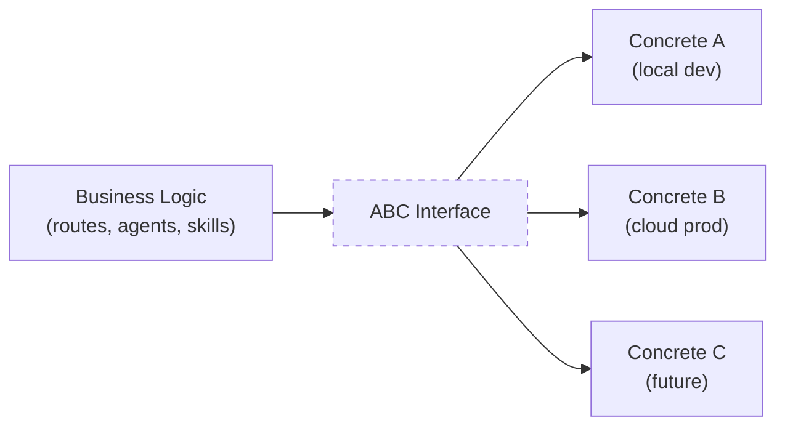
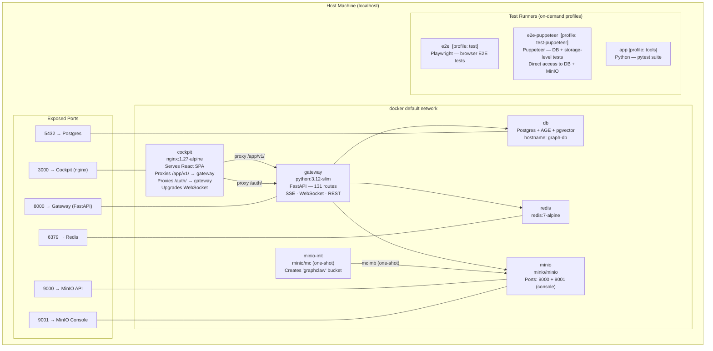
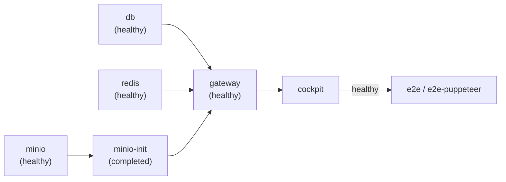
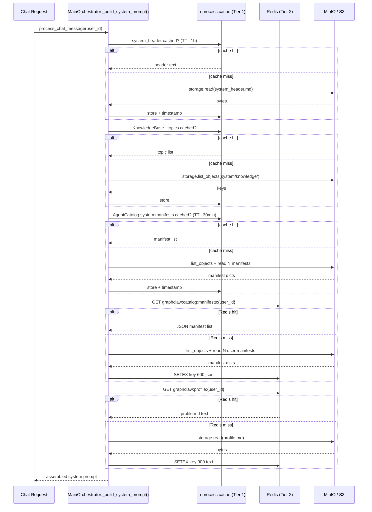
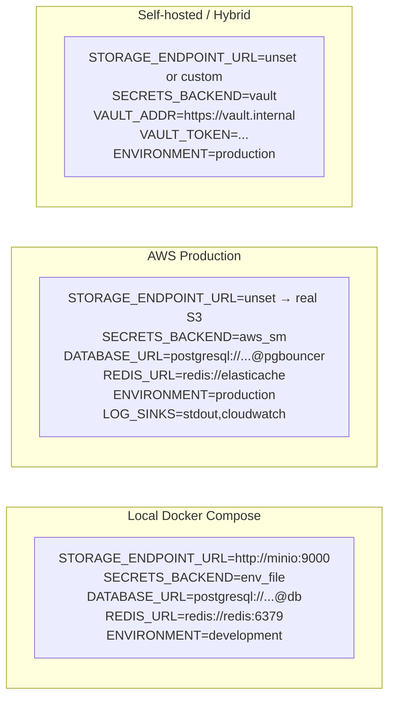

# 09 — Infrastructure Abstractions & Backend Swapping

This document covers the pluggable infrastructure layer that lets GraphClaw run
identically in local Docker Compose, AWS production, or any future cloud
without touching business logic.  It also covers the combined cockpit+backend
deployment stack and maps every environment variable to the decision it controls.

---

## Design Principle

Every infrastructure dependency is hidden behind an **Abstract Base Class (ABC)**.
Application code programs against the ABC only.  The concrete backend that
implements it is selected at startup via a single environment variable.
Swapping a backend is a configuration change, not a code change.



---

## Abstraction Map

| Layer | ABC | Module | Concrete Implementations |
|---|---|---|---|
| Object Storage | `StorageClient` | `graphclaw.infra.storage` | `S3StorageClient` (covers MinIO **and** AWS S3) |
| Message Broker | `MessageBroker` | `graphclaw.infra.broker` | `RedisMessageBroker` · *(SQSMessageBroker — planned)* |
| Secrets | `SecretsClient` | `graphclaw.infra.secrets` | `EnvFileSecretsClient` · `AWSSecretsClient` · `HashiCorpVaultClient` |
| Database | *(none yet)* | `graphclaw.config` | Postgres + Apache AGE (hardwired via `DATABASE_URL`) |
| Logging sinks | `LogSink` | `graphclaw.infra.sinks` | `StdoutSink` · `ObjectStorageSink` · `CloudWatchSink` |
| Caching | *(no ABC — two-tier, see §Caching)* | `graphclaw.agent.catalog`, `graphclaw.agent.knowledge`, `graphclaw.agent.main_orchestrator` | In-process TTL dict (static data) · Redis (user-scoped mutable data) |

---

## Object Storage: MinIO → AWS S3

### How it works

`S3StorageClient` wraps boto3.  boto3 routes all S3 API calls to whatever
endpoint you point it at.  MinIO is fully S3-compatible, so the same client
class and API works for both.

The only difference between environments is the `endpoint_url` parameter:

```python
# infra/config.py — StorageConfig.from_env()
return cls(
    bucket=os.environ.get("STORAGE_BUCKET", "graphclaw"),
    endpoint_url=os.environ.get("STORAGE_ENDPOINT_URL"),   # None → real S3
    region=os.environ.get("STORAGE_REGION", "us-east-1"),
)
```

```python
# infra/storage.py — S3StorageClient._get_client()
kwargs = {"region_name": self._region}
if self._endpoint_url is not None:
    kwargs["endpoint_url"] = self._endpoint_url   # MinIO path
# AWS_ACCESS_KEY_ID / SECRET picked up automatically from env or IAM role
self._client = boto3.client("s3", **kwargs)
```

### Environment diff

| Variable | Local (MinIO) | AWS Production |
|---|---|---|
| `STORAGE_ENDPOINT_URL` | `http://minio:9000` | *(unset — boto3 uses `s3.amazonaws.com`)* |
| `STORAGE_BUCKET` | `graphclaw` | `graphclaw-prod` (or your bucket name) |
| `STORAGE_REGION` | `us-east-1` | Your AWS region |
| `AWS_ACCESS_KEY_ID` | `graphclaw` (MinIO root user) | *(unset — EC2/ECS IAM role provides credentials)* |
| `AWS_SECRET_ACCESS_KEY` | `graphclaw_dev` | *(unset — IAM role)* |

### Docker Compose diff

Local dev stack includes two MinIO services that are **dropped entirely** in AWS:

```yaml
# LOCAL — present in docker-compose.yml
minio:
  image: minio/minio:latest
  command: server /data --console-address ":9001"
  ports: ["9000:9000", "9001:9001"]

minio-init:           # one-shot bucket creator
  image: minio/mc:latest
  restart: "no"

# AWS PRODUCTION — remove both; gateway points to real S3 via env vars
```

---

## Message Broker: Redis → SQS

### How it works

The `MessageBroker` ABC defines three operations: `publish`, `consume`, `acknowledge`.
`RedisMessageBroker` implements them with `LPUSH` / `BRPOP`.

The wiring point is [gateway/server.py](../../src/graphclaw/gateway/server.py):

```python
_redis_url = os.environ.get("REDIS_URL", "redis://localhost:6379")
_broker = RedisMessageBroker(url=_redis_url)
app = create_app(broker=_broker)
```

To add SQS, implement `SQSMessageBroker(MessageBroker)` and select it here
based on a `BROKER_BACKEND=redis|sqs` env var.  No route or agent code changes.

### Queue names (defined as module-level constants)

| Constant | Queue | Purpose |
|---|---|---|
| `INBOUND_MESSAGES` | `inbound_messages` | Incoming channel messages (email, Slack, …) |
| `TRIGGER_EVENTS` | `trigger_events` | Task trigger signals |
| `SKILL_JOBS` | `skill_jobs` | Skill execution dispatch |
| `STATUS_UPDATES` | `status_updates` | Task state change events |
| `OUTBOUND_MESSAGES` | `outbound_messages` | Outbound channel delivery |
| `AGENT_JOBS` | `agent_jobs` | Sub-agent delegation jobs (Phase 5) |
| `AGENT_UPDATES` | `agent_updates` | Sub-agent heartbeat / completion events |

---

## Secrets: `SECRETS_BACKEND` selector

The `SECRETS_BACKEND` environment variable tells the gateway which
`SecretsClient` to instantiate.

| `SECRETS_BACKEND` value | Backend | When to use |
|---|---|---|
| `env_file` | `EnvFileSecretsClient` — reads `os.environ` (loaded from `.env` via dotenv) | Local Docker Compose dev |
| `aws_sm` | `AWSSecretsClient` — AWS Secrets Manager via boto3 | AWS deployments |
| `vault` | `HashiCorpVaultClient` — HashiCorp Vault KV v2 via httpx | Self-hosted / hybrid cloud |

All three implement `get_secret(key)`, `set_secret(key, value)`, `delete_secret(key)`.
No route or agent code knows which backend is active.

### AWS Secrets Manager layout

All secrets are stored under the prefix `graphclaw/` in Secrets Manager:

```
graphclaw/
├── jwt/private-key          RS256 private key (PEM)
├── jwt/public-key           RS256 public key (PEM)
├── db/password              Postgres password
├── redis/auth-token         Redis AUTH token
├── oauth/google/client-secret
├── oauth/github/client-secret
├── oauth/microsoft/client-secret
├── llm/anthropic/api-key
├── llm/openai/api-key
└── byok/{user_id}/{key}     User BYOK (Bring Your Own Key) secrets
```

### HashiCorp Vault env vars

| Variable | Description |
|---|---|
| `VAULT_ADDR` | Vault server URL (default `http://localhost:8200`) |
| `VAULT_TOKEN` | Vault authentication token |
| `VAULT_NAMESPACE` | Vault Enterprise namespace (omit for OSS Vault) |

---

## Logging Sinks: `LOG_SINKS` selector

Multiple sinks can be active simultaneously (comma-separated list).

| Sink name | Class | When to use |
|---|---|---|
| `stdout` | `StdoutSink` | Always — default for all environments |
| `object_storage` | `ObjectStorageSink` | Write hourly JSONL files to S3/MinIO |
| `cloudwatch` | `CloudWatchSink` | AWS CloudWatch Logs integration |

```bash
# Local dev — stdout only
LOG_SINKS=stdout

# AWS production — stdout + CloudWatch
LOG_SINKS=stdout,cloudwatch
CLOUDWATCH_REGION=us-east-1
CLOUDWATCH_LOG_GROUP_PREFIX=/graphclaw

# Full audit — all three
LOG_SINKS=stdout,object_storage,cloudwatch
```

Object storage logs land at `{user_id}/logs/{service}/{YYYY-MM-DD}/{HHmmZ}.jsonl`
(paths via `StoragePaths.user_log_path`).

---

## Database: Current State and Migration Path

### Current state (no abstraction)

The database layer is the one infra subsystem that does **not** have an ABC.
The connection DSN is wired directly in [config.py](../../src/graphclaw/config.py):

```python
@dataclass(frozen=True)
class DatabaseConfig:
    dsn: str = field(default_factory=lambda: os.environ["DATABASE_URL"])
    min_pool_size: int = field(default_factory=lambda: int(os.getenv("DB_POOL_MIN", "2")))
    max_pool_size: int = field(default_factory=lambda: int(os.getenv("DB_POOL_MAX", "10")))
    graph_name: str = field(default_factory=lambda: os.getenv("AGE_GRAPH_NAME", "graphclaw"))
```

All graph queries are raw Cypher-within-SQL via Apache AGE syntax executed
through psycopg.  Example:

```sql
SELECT * FROM cypher('graphclaw', $$
    MATCH (t:Task {id: $task_id}) RETURN t
$$, $1) AS (t agtype);
```

### What swapping to Neo4j would require

Neo4j uses the **Bolt protocol** (`neo4j://`) and the `neo4j` Python async
driver — a completely different transport and query API from psycopg.

The migration path:

1. **Define `GraphDBClient` ABC** with methods like
   `execute_cypher(query, params)` and `execute_query(sql, params)`.
2. **Implement `AGEGraphDBClient`** wrapping the existing psycopg pool.
3. **Implement `Neo4jGraphDBClient`** using the `neo4j.AsyncDriver`.
4. **Add selector**: `GRAPH_BACKEND=age|neo4j` env var that picks the implementation
   at startup (same pattern as `SECRETS_BACKEND`).
5. **`DATABASE_URL` format changes**: `postgresql://...` becomes `neo4j://...`.
6. All query sites that currently call `conn.execute(...)` must go through the
   ABC instead.

Until that abstraction exists, `DATABASE_URL` must always point to a Postgres
instance with AGE enabled.

---

## Full-Stack Deployment: Cockpit + Backend Together

The **cockpit** repo (`graphclaw-cockpit`) ships its own
[docker-compose.yml](../../../graphclaw-cockpit/docker-compose.yml) that
brings up the **entire** stack — backend infrastructure included.  This is the
canonical way to run the full application locally.



### nginx reverse proxy (cockpit)

The cockpit container runs nginx on port 3000.  nginx serves the compiled
React SPA and reverse-proxies three categories of backend traffic:

| Location | Backend | Notes |
|---|---|---|
| `/app/v1/` | `gateway:8000` | All REST + SSE endpoints; `proxy_buffering off` for SSE |
| `/auth/` | `gateway:8000` | OAuth callback routes |
| `/app/v1/chat/ws` | `gateway:8000` | WebSocket upgrade (`Upgrade: websocket`) |
| `/assets/` | Static files | 1-year immutable cache |
| Everything else | `index.html` | SPA client-side routing fallback |

Frontend code never knows the gateway's address — all API calls go to the
same origin (`localhost:3000`) and nginx routes them.

### Startup dependency chain



### Why two separate docker-compose files?

| File | Purpose |
|---|---|
| `graphclaw/docker/docker-compose.yml` | Backend-only stack for pure API development; includes `pgbouncer` for connection pooling; `gateway` runs with `--reload` via volume-mounted source |
| `graphclaw-cockpit/docker-compose.yml` | Full-stack deployment; cockpit built as a production nginx image; no `pgbouncer` (gateway connects directly to `db`); adds cockpit + E2E test runners |

The cockpit compose references the backend via a relative `../graphclaw` context:

```yaml
db:
  build:
    context: ../graphclaw          # ← backend repo
    dockerfile: docker/Dockerfile.db

gateway:
  build:
    context: ../graphclaw
    dockerfile: docker/Dockerfile.gateway
```

---

---

## Caching

GraphClaw uses a deliberate **two-tier caching strategy** to eliminate redundant MinIO reads per agent cycle without over-engineering.

### Why two tiers?

`MainOrchestrator` is a **singleton** — created once at app startup and stored as `app.state.agent_loop`.  Every chat turn calls `_build_system_prompt(user_id)`, which previously re-read several files from MinIO on every call.  The right cache tier depends on two axes:

| Axis | In-process TTL | Redis |
|------|---------------|-------|
| **Scope** | Global / singleton-lifetime | Per-user (scales with user count) |
| **Change frequency** | Deploy-time only | User can modify between sessions |
| **Survives restart?** | No (acceptable — data re-seeded from MinIO) | Yes |
| **Multi-worker safe?** | No (single process today) | Yes (ready to scale) |

### Tier 1 — In-process TTL (static, global data)

Stored as plain attributes on the singleton class instance with a `time.monotonic()` timestamp.  No external dependency.  Lost on restart (acceptable — data exists in MinIO and is cheap to re-seed).

| Data | Owner class | Attribute | TTL | Rationale |
|------|------------|-----------|-----|-----------|
| `system/prompts/system_header.md` | `MainOrchestrator` | `_system_header`, `_system_header_at` | 1 h | Static text, changes only on deploy |
| `system/knowledge/` topic list | `KnowledgeBase` | `_topics` | Process lifetime | 6 topic names; never changes without a code deploy |
| `system/knowledge/{topic}.md` content | `KnowledgeBase` | `_cache: dict[str, str]` | Process lifetime | Read-only seeded content *(was already cached)* |
| `system/agents/*/manifest.json` list | `AgentCatalog` | `_system_manifests`, `_system_manifests_at` | 30 min | Admin-seeded, rarely changes |

### Tier 2 — Redis (user-scoped mutable data)

Stored in Redis with explicit TTLs.  Gracefully degrades to a direct MinIO read when Redis is unavailable (same no-op pattern as `ConversationContextCache`).  Properly scoped per user to prevent cross-user cache pollution.

| Data | Key pattern | TTL | Invalidated by |
|------|-------------|-----|---------------|
| User agent manifests | `graphclaw:catalog:manifests:{user_id}` | 10 min | `AgentCatalog.invalidate_user_catalog(user_id)` — call from create/delete agent endpoints |
| User agent profile (`profile.md`) | `graphclaw:profile:{user_id}` | 15 min | `MainOrchestrator.invalidate_user_profile(user_id)` — call from update profile endpoint |
| Conversation message history | `graphclaw:ctx:{session_id}` | 24 h | `ConversationContextCache.clear(session_id)` *(pre-existing)* |

### Redis key namespace summary

```
graphclaw:ctx:{session_id}            — conversation history (pre-existing)
graphclaw:catalog:manifests:{user_id} — user agent manifest list (NEW)
graphclaw:profile:{user_id}           — user agent profile.md content (NEW)
```

### Data flow — chat turn with caching



### Before vs after (per chat turn)

| Operation | Before | After |
|-----------|--------|-------|
| `system_header.md` reads | 1× MinIO read | 0 (TTL 1h in-process) |
| `list_topics()` storage calls | 1× `list_objects()` | 0 (process lifetime) |
| System manifest reads | N+1× MinIO (list + read each) | 0 (TTL 30min in-process) |
| User manifest reads | N+1× MinIO (list + read each) | 1× Redis GET |
| `profile.md` reads | 1× MinIO read | 1× Redis GET |

### Redis wiring in `gateway/app.py`

`app.state.redis` (already initialised) is now passed through to `MainOrchestrator`:

```python
agent_loop = MainOrchestrator(
    ...
    redis_client=getattr(app.state, "redis", None),   # NEW
)
```

`MainOrchestrator.__init__` forwards `redis_client` to `AgentCatalog` and uses it directly for profile caching.

---

## Complete Environment Variable Reference

### Infrastructure wiring

| Variable | Default | Controls |
|---|---|---|
| `DATABASE_URL` | *(required)* | Postgres+AGE DSN — e.g. `postgresql://graphclaw:pass@db:5432/graphclaw` |
| `DB_POOL_MIN` | `2` | Minimum psycopg connection pool size |
| `DB_POOL_MAX` | `10` | Maximum psycopg connection pool size |
| `AGE_GRAPH_NAME` | `graphclaw` | Apache AGE graph name used in all Cypher queries |
| `REDIS_URL` | `redis://localhost:6379` | Redis broker connection URL |
| `STORAGE_BUCKET` | `graphclaw` | S3 / MinIO bucket name |
| `STORAGE_ENDPOINT_URL` | *(unset)* | MinIO override; unset = real AWS S3 |
| `STORAGE_REGION` | `us-east-1` | S3 region |
| `AWS_ACCESS_KEY_ID` | *(unset)* | S3/MinIO access key (omit on EC2/ECS — IAM role used) |
| `AWS_SECRET_ACCESS_KEY` | *(unset)* | S3/MinIO secret key |
| `SECRETS_BACKEND` | `env_file` | `env_file` · `aws_sm` · `vault` |
| `VAULT_ADDR` | `http://localhost:8200` | HashiCorp Vault server URL |
| `VAULT_TOKEN` | *(unset)* | Vault authentication token |
| `VAULT_NAMESPACE` | *(unset)* | Vault Enterprise namespace |

### Application behaviour

| Variable | Default | Controls |
|---|---|---|
| `ENVIRONMENT` | `production` | `development` enables `/auth/dev-token` endpoint |
| `ANTHROPIC_API_KEY` | *(unset)* | Anthropic Claude API key |
| `LOG_LEVEL` | `INFO` | Minimum log level (`DEBUG` · `INFO` · `WARNING` · `ERROR`) |
| `LOG_FORMAT` | `jsonl` | Log line format (`jsonl` · `pipe`) |
| `LOG_SINKS` | `stdout` | Comma-separated list: `stdout` · `object_storage` · `cloudwatch` |
| `CLOUDWATCH_REGION` | `us-east-1` | CloudWatch log region |
| `CLOUDWATCH_LOG_GROUP_PREFIX` | `/graphclaw` | CloudWatch log group prefix |

### Auth (OAuth 2.0 + RS256 JWT)

| Variable | Default | Controls |
|---|---|---|
| `JWT_PRIVATE_KEY` | *(generated in-memory)* | RS256 signing key (PEM). Leave unset in local dev; set in prod. |
| `JWT_PUBLIC_KEY` | *(generated in-memory)* | RS256 verify key (PEM) |
| `OAUTH_REDIRECT_BASE_URL` | `http://localhost:8000` | Base URL where IdP sends OAuth callbacks |
| `COCKPIT_BASE_URL` | `http://localhost:3000` | Base URL where browser lands after auth |
| `OAUTH_GOOGLE_CLIENT_ID` | *(unset)* | Google OAuth 2.0 client ID |
| `OAUTH_GOOGLE_CLIENT_SECRET` | *(unset)* | Google OAuth 2.0 client secret |
| `OAUTH_GITHUB_CLIENT_ID` | *(unset)* | GitHub OAuth client ID |
| `OAUTH_GITHUB_CLIENT_SECRET` | *(unset)* | GitHub OAuth client secret |
| `OAUTH_MICROSOFT_CLIENT_ID` | *(unset)* | Microsoft OAuth client ID |
| `OAUTH_MICROSOFT_CLIENT_SECRET` | *(unset)* | Microsoft OAuth client secret |

### Gateway channels

| Variable | Default | Controls |
|---|---|---|
| `GATEWAY_ENABLED_CHANNELS` | `email` | Comma-separated active channels: `email` · `telegram` · `slack` · `teams` |
| `GATEWAY_IMAP_HOST` | *(unset)* | IMAP server host |
| `GATEWAY_IMAP_PORT` | `993` | IMAP port |
| `GATEWAY_IMAP_USER` | *(unset)* | IMAP login username |
| `GATEWAY_IMAP_PASS` | *(unset)* | IMAP login password |
| `GATEWAY_IMAP_FOLDER` | `INBOX` | IMAP folder to poll |
| `GATEWAY_IMAP_POLL_INTERVAL` | `60` | Seconds between IMAP polls |
| `GATEWAY_SMTP_HOST` | *(unset)* | SMTP server host |
| `GATEWAY_SMTP_PORT` | `587` | SMTP port |
| `EMAIL_BACKEND` | `imap` | `imap` (local dev) · `ses` (AWS production) |
| `SES_S3_BUCKET` | `graphclaw-inbound-email` | S3 bucket where SES drops inbound email |
| `SES_LAMBDA_SECRET` | *(unset)* | Shared secret between SES Lambda and gateway |
| `TELEGRAM_BOT_TOKEN` | *(unset)* | Telegram Bot API token |
| `TELEGRAM_USE_WEBHOOK` | `false` | `true` = webhook mode; `false` = polling |
| `TELEGRAM_POLL_TIMEOUT` | `30` | Long-poll timeout (seconds) |

### Sub-agent orchestration (Phase 5)

| Variable | Default | Controls |
|---|---|---|
| `GRAPHCLAW_MAX_CONCURRENT_AGENTS` | `4` | Max simultaneous SubAgentRunner instances |
| `GRAPHCLAW_SUBAGENT_WORKER_POOL_SIZE` | `4` | Dedicated SkillWorker pool for sub-agents |
| `GRAPHCLAW_AGENT_HEARTBEAT_INTERVAL_SECONDS` | `60` | How often each sub-agent emits a heartbeat |
| `GRAPHCLAW_AGENT_HEARTBEAT_TIMEOUT_SECONDS` | `300` | Inactivity before task is marked BLOCKED |
| `GRAPHCLAW_SUBAGENT_EXECUTION_TIMEOUT_SECONDS` | `600` | Hard timeout per sub-agent run |
| `GRAPHCLAW_SUBAGENT_TOOL_TIMEOUT_SECONDS` | `120` | Per-tool call timeout |
| `GRAPHCLAW_SUBAGENT_TOOL_MAX_RETRIES` | `0` | Max retries for retry-eligible tools |

### Cockpit frontend (VITE_ prefix — baked in at build time)

| Variable | Default | Controls |
|---|---|---|
| `VITE_ENABLE_DEV_AUTH` | `false` | `true` shows the "Dev Token" login button in the cockpit |
| `VITE_API_URL` | *(empty — uses nginx proxy)* | API base URL override (only for standalone dev without nginx) |

---

## Environment Profiles at a Glance



---

## Adding a New Backend

The pattern for adding any new infrastructure backend is the same:

1. **Write a concrete class** that implements the relevant ABC
   (`StorageClient`, `MessageBroker`, `SecretsClient`, or `LogSink`).
2. **Add a selector** in the wiring point (e.g. `gateway/server.py`,
   `gateway/deps.py`) that reads an env var and instantiates your class.
3. **Update `.env.example`** with the new variable and its purpose.
4. **Update this document** with the new backend in the abstraction map.

No changes are needed in routes, agents, skills, or any business logic.
